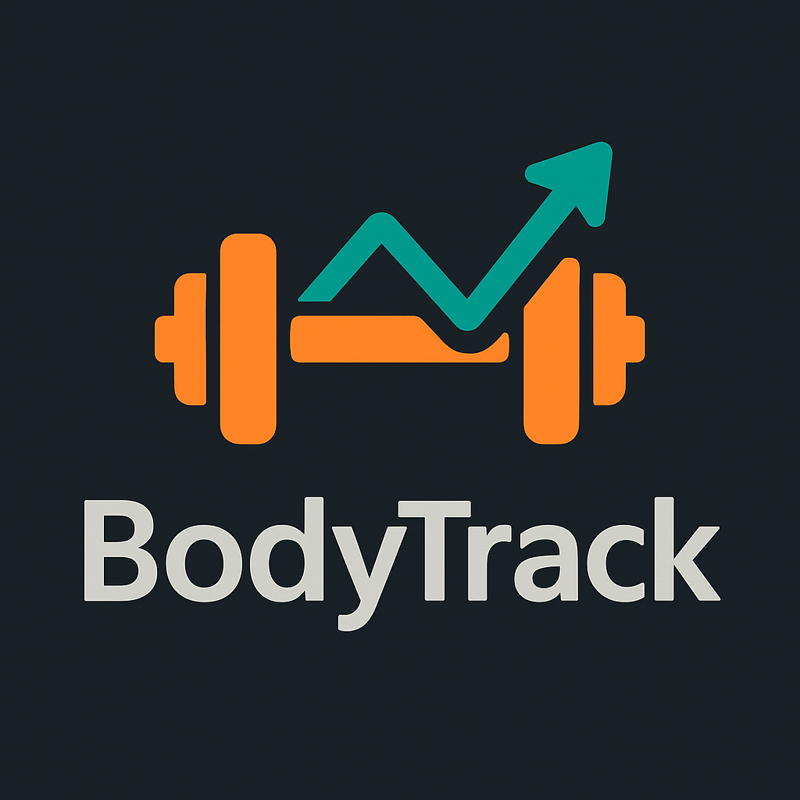

# 🏋️ BodyTrack - Fitness Progress Tracker



**BodyTrack** is a comprehensive fitness progress tracking application that helps users monitor their body transformation through metric tracking and data visualization.

## ✨ Features

### 📊 Progress Tracking
- Log daily/weekly body measurements (weight, waist, hips)
- Interactive charts with multiple view options
- Progress comparison over custom time periods

### 🔐 User Management
- Secure JWT authentication
- Profile customization
- Account management (password change, deletion)

### 📱 Responsive Design
- Mobile-first approach
- Cross-device compatibility
- Dark/light mode support

## 🧱 Tech Stack

### Frontend
| Technology       | Purpose                          |
|------------------|----------------------------------|
| React 18         | Component-based UI               |
| TypeScript       | Type-safe JavaScript             |
| Vite             | Blazing fast build tool          |
| Tailwind CSS     | Utility-first styling            |
| Chart.js         | Data visualization               |
| React Hook Form  | Form management                  |

### Backend
| Technology       | Purpose                          |
|------------------|----------------------------------|
| Node.js          | JavaScript runtime               |
| Express          | Web framework                    |
| MongoDB          | NoSQL database                   |
| Mongoose         | MongoDB object modeling          |
| JWT              | Authentication                   |

## 🚀 Quick Start

### Prerequisites
- Node.js (v18+)
- MongoDB (v6+)
- Yarn or npm

### Installation
```bash
# Clone repository
git clone https://github.com/yourusername/bodytrack.git
cd bodytrack

# Install dependencies
cd backend && npm install
cd ../frontend && npm install